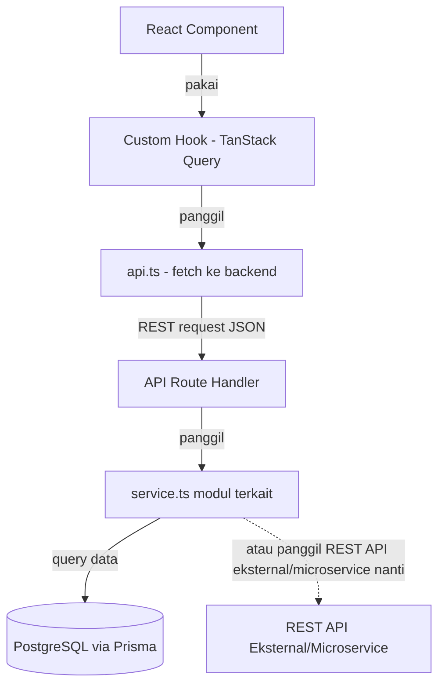
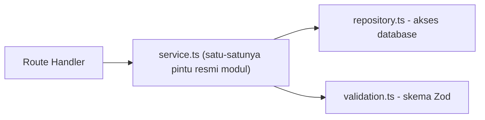
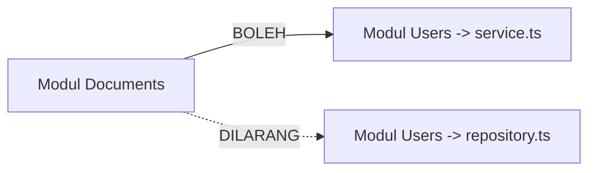

# PRD — Sistem Manajemen Dokumen Pegawai (SMDP) Portal
### Monolit Modular yang Sederhana — REST API First, Siap Upgrade ke Microservice

---

## 0. Document Control

| Field | Value |
|---|---|
| **Document ID** | `PRD-SMDP-PORTAL-v1.0-20260627` |
| **Judul Dokumen** | Product Requirement Document — SMDP Portal |
| **Kode Proyek** | `SMDP` |
| **Versi** | 1.0 |
| **Status** | `Draft for Implementation` |
| **Tanggal Dibuat** | 2026-06-27 |
| **Ditulis untuk** | Junior Programmer (Next.js/TypeScript) & AI Coding Agent |
| **Gaya Arsitektur** | Monolit Modular Sederhana, komunikasi REST API |

---

## 1. Filosofi Dokumen Ini — Keep It Simple (KIS)

Dokumen ini ditulis dengan satu prinsip utama: **mudah dikerjakan dan mudah dipahami**, baik oleh programmer junior maupun AI coding agent.

Asumsi kemampuan tim yang mengerjakan proyek ini:
- Mengerti dasar **RESTful API** dan autentikasi sederhana (login, token/session).
- Mengerti **Next.js** dengan JavaScript/TypeScript.
- Mengerti **Tailwind CSS** dan **Shadcn UI**.
- Mengerti dasar **PostgreSQL/MySQL** (tabel, relasi, query sederhana).

Karena itu, beberapa keputusan desain di dokumen ini sengaja dibuat sesederhana mungkin:
- **Tidak ada** pola arsitektur rumit (event bus, message queue, dependency injection framework).
- **Tidak ada** gRPC, GraphQL, atau protokol komunikasi lain — **REST API tetap menjadi pilihan utama**, baik untuk frontend ↔ backend saat ini, maupun nanti kalau sebagian sistem dipisah jadi service sendiri.
- Setiap modul fitur hanya punya **beberapa file dengan nama yang jelas** (`service.ts`, `repository.ts`, `validation.ts`, `api.ts`, `hooks.ts`) — bukan puluhan file kecil.
- Aturan antar modul cukup **satu kalimat**: *"modul lain hanya boleh dipanggil lewat `service.ts`-nya, tidak boleh lewat file lain."*

Proyek ini **dimulai dari nol** sebagai monolit, tapi disusun rapi sejak awal supaya kalau suatu saat satu bagian sistem perlu dipisah menjadi service sendiri (microservice), perpindahannya tidak perlu menulis ulang logika bisnis dari awal.

---

## 2. Ringkasan Proyek

**SMDP Portal** adalah aplikasi web internal untuk mengelola, melacak, dan memverifikasi berkas kualifikasi administrasi, profesi, dan sertifikasi dinas seluruh pegawai (tenaga medis, keperawatan, administrasi, dsb), menggantikan pengelolaan berkas fisik dengan digitalisasi yang aman dan terstandarisasi.

---

## 3. Tujuan Proyek

1. **Digitalisasi & Kepatuhan Berkas Mandatori** — pegawai mengunggah dokumen wajib sesuai profesinya (mis. STR Medis bagi Dokter).
2. **Otorisasi Berlapis (RBAC)** — 3 peran: `ADMIN`, `STAFF`, `EMPLOYEE`.
3. **Peringatan Masa Berlaku** — memantau dokumen yang mendekati kedaluwarsa.
4. **Audit Trail Keamanan** — mencatat semua aktivitas sensitif.
5. **Pengelompokan Arsip Dokumen** — setiap dokumen dikategorikan ke dalam 3 jenis arsip:
   - **Arsip Utama** — dokumen identitas dasar, wajib untuk **semua** pegawai (contoh: KTP, Ijazah, KK).
   - **Arsip Kondisional** — dokumen pendukung yang sifatnya opsional/tergantung situasi pegawai (contoh: Sertifikat Penghargaan, Sertifikat Pelatihan).
   - **Arsip Profesi** — dokumen izin praktik, **khusus tenaga medis/kesehatan** tertentu (contoh: STR, SIP, SIK).

---

## 4. Tech Stack

| Layer | Teknologi | Kenapa Dipilih |
|---|---|---|
| Framework | `Next.js` (App Router) + `React` + `TypeScript` | Satu framework untuk frontend & backend (API Routes), cocok untuk monolit |
| Styling | `Tailwind CSS` + `Shadcn UI` | Sudah dikenal tim, komponen siap pakai |
| Data Fetching (Client) | **`@tanstack/react-query`** | Mengurus cache, loading, error, dan refetch otomatis — tim tidak perlu bikin state loading manual |
| Database | **`PostgreSQL`** | Relasional, mendukung relasi banyak-ke-banyak dan enum dengan baik |
| ORM | `Prisma` | Query database jadi seperti memanggil fungsi JavaScript, aman dari SQL Injection |
| Autentikasi | `NextAuth.js` (Credentials Provider) | Login email+password yang hasilnya disimpan otomatis di sesi/cookie — konsepnya sama dengan "basic auth" yang sudah dikenal tim, tapi penyimpanannya sudah ditangani library, tidak perlu dibuat manual |
| Validasi | `Zod` | Memastikan data yang masuk ke API sudah benar bentuknya sebelum diproses |
| Penyimpanan File | Provider lokal/cloud lewat satu fungsi `getStorageProvider()` | Mudah ganti dari simpan-di-server ke cloud storage tanpa mengubah kode modul lain |

> **Catatan tentang database:** dipilih PostgreSQL, tapi seluruh desain skema di dokumen ini **sengaja dibuat portabel** (memakai enum & tabel relasi standar, bukan fitur khusus PostgreSQL) sehingga kalau suatu saat harus pindah ke MySQL, perubahan yang dibutuhkan minim. Detail di §8.

---

## 5. Aturan Emas (Wajib Diingat Setiap Mengerjakan Fitur)

1. Komponen React **tidak pernah** memanggil `fetch` langsung → selalu lewat custom hook (`hooks.ts`).
2. Custom hook hanya boleh memanggil `api.ts` **di modul yang sama**.
3. API Route Handler (`app/api/...`) hanya boleh memanggil `service.ts` **di modul yang sama**.
4. Kalau modul A butuh data dari modul B → modul A **hanya boleh** memanggil fungsi yang diekspor `service.ts` milik modul B. **Dilarang** mengimpor `repository.ts` modul lain secara langsung.
5. Semua input dari luar (form, query string, body request) **wajib** divalidasi dengan Zod sebelum diproses.
6. Semua aksi penting (login, login gagal, upload, approve/reject, hapus, ekspor data) **wajib** dicatat ke Security Log lewat satu fungsi helper, `logActivity()`.
7. Semua komunikasi API memakai **REST (JSON di atas HTTP)** — bukan gRPC, bukan GraphQL.
8. Halaman (`page.tsx`) hanya berisi: cek hak akses (`requireRole`) + render satu komponen dari modul. Logika tampilan **tidak** ditulis di `page.tsx`.

---

## 6. Arsitektur: Monolit Modular Sederhana

### 6.1 Konsep Dasar (Analogi Sederhana)

Bayangkan aplikasi ini seperti **gedung kantor dengan beberapa departemen** (Users, Documents, Verification, dst). Setiap departemen punya **satu meja resepsionis** (`service.ts`). Departemen lain yang butuh sesuatu **wajib lewat resepsionis itu**, tidak boleh langsung masuk ke ruang arsip (`repository.ts`) departemen lain.

Keuntungannya: kalau suatu hari satu departemen dipindah ke gedung lain (jadi microservice terpisah), departemen lain tidak perlu tahu — mereka tetap "menelepon resepsionis yang sama", hanya saja di baliknya resepsionis itu sekarang meneruskan permintaan lewat REST API ke gedung sebelah, bukan jalan kaki ke ruang arsip.

### 6.2 Diagram Arsitektur



### 6.3 Struktur di Dalam Satu Modul



| File | Isi |
|---|---|
| `service.ts` | Logika bisnis. **Satu-satunya** file yang boleh diimpor modul lain. |
| `repository.ts` | Query Prisma ke database. Hanya dipanggil oleh `service.ts` modul yang sama. |
| `validation.ts` | Skema Zod untuk validasi request. |
| `types.ts` | Tipe data/interface milik modul. |
| `api.ts` *(frontend)* | Fungsi `fetch()` ke endpoint REST modul ini. |
| `hooks.ts` *(frontend)* | `useQuery`/`useMutation` yang membungkus `api.ts`. |
| `components/` *(frontend)* | Komponen React/halaman untuk modul ini. |

### 6.4 Aturan Antar Modul



```ts
// src/modules/documents/service.ts
import { getProfessionGroupName } from "@/modules/users/service"; // ✅ BENAR - lewat service.ts

// import { findUserById } from "@/modules/users/repository";      // ❌ DILARANG - jangan loncat pagar
```

### 6.5 Contoh Nyata yang Sudah Mempraktikkan Pola Ini: Modul Calendar

Modul `calendar` mengambil data hari libur nasional dari **API eksternal** (bukan database sendiri). Pola pemanggilannya **sama persis** dengan pola memanggil modul lain secara internal:

```ts
// src/modules/calendar/service.ts
export async function getNationalHolidays(year: number) {
  const res = await fetch(`https://api-libur-nasional.example.com/${year}`); // REST API eksternal
  return res.json();
}
```

Ini adalah contoh paling sederhana dari prinsip "siap konsumsi microservice": **dari sudut pandang modul lain, tidak ada bedanya** memanggil `getNationalHolidays()` yang isinya query database lokal, atau yang isinya memanggil REST API service lain. Pola ini yang nantinya dipakai kalau modul `documents` atau `users` dipindah jadi microservice sungguhan — kode di `service.ts` modul itu diganti isinya (dari query Prisma menjadi `fetch()` ke service baru), **tanpa mengubah satu baris pun** kode di modul yang memanggilnya.

### 6.6 Kenapa Tetap REST, Bukan gRPC

| Pertimbangan | REST API | gRPC |
|---|---|---|
| Kemudahan dipahami pemula | ✅ Mudah — sama seperti yang sudah dikenal tim | ❌ Butuh pemahaman protobuf & HTTP/2 |
| Tooling debugging | ✅ Browser DevTools, Postman | ❌ Butuh tool khusus |
| Kebutuhan proyek saat ini | ✅ Cukup | Berlebihan untuk skala proyek ini |

**Keputusan: REST API adalah satu-satunya cara komunikasi di proyek ini**, baik sekarang (frontend↔backend) maupun nanti (service↔service). gRPC tidak dipakai sama sekali.

---

## 7. Struktur Folder Proyek

```
smdp/
├── prisma/
│   ├── schema.prisma
│   └── seed.ts
├── docs/
│   ├── PRD-SMDP-PORTAL-v1.0-20260627.md   # Dokumen ini
│   └── naming-convention.md
├── src/
│   ├── app/
│   │   ├── (dashboard)/                   # Halaman yang butuh login
│   │   │   ├── layout.tsx                 # Sidebar + Navbar
│   │   │   ├── dashboard/page.tsx
│   │   │   ├── documents/page.tsx         # Tab: Arsip Utama / Kondisional / Profesi
│   │   │   ├── verification/page.tsx
│   │   │   ├── verification/[id]/page.tsx
│   │   │   ├── document-types/page.tsx
│   │   │   ├── users/page.tsx
│   │   │   ├── security-logs/page.tsx
│   │   │   └── profile/page.tsx
│   │   ├── api/
│   │   │   └── v1/                        # REST API, diberi versi sejak awal
│   │   │       ├── auth/[...nextauth]/route.ts
│   │   │       ├── documents/route.ts
│   │   │       ├── documents/upload/route.ts
│   │   │       ├── documents/[id]/route.ts
│   │   │       ├── document-types/route.ts
│   │   │       ├── users/route.ts
│   │   │       └── security-logs/route.ts
│   │   ├── login/page.tsx
│   │   ├── layout.tsx
│   │   ├── providers.tsx                  # Bungkus QueryClientProvider
│   │   └── page.tsx
│   ├── components/                        # UI bersama (Sidebar, Navbar, StatsCard, dst — basis Shadcn)
│   ├── modules/                           # Satu folder = satu domain bisnis
│   │   ├── auth/        { service.ts, validation.ts, types.ts, api.ts, hooks.ts, components/ }
│   │   ├── users/        { service.ts, repository.ts, validation.ts, types.ts, api.ts, hooks.ts, components/ }
│   │   ├── document-types/ (pola sama seperti users)
│   │   ├── documents/      (pola sama seperti users)
│   │   ├── verification/   (pola sama seperti users)
│   │   ├── profile/        (pola sama seperti users)
│   │   ├── security-logs/  (pola sama seperti users)
│   │   └── dashboard/      { hooks.ts, components/ }  # Hanya merangkum, tidak punya tabel sendiri
│   └── lib/
│       ├── prisma.ts                      # Satu koneksi Prisma untuk semua modul
│       ├── auth-utils.ts                  # requireRole(), hasRole()
│       ├── api-client.ts                  # fetch wrapper kecil, dipakai semua api.ts
│       ├── security-log.ts                # logActivity() — dipanggil langsung, tidak perlu event bus
│       └── storage.ts                     # getStorageProvider()
├── components.json
└── next.config.ts
```

> **Catatan:** kalau satu modul mulai punya banyak hook, boleh dipecah `hooks.ts` jadi folder `hooks/` berisi beberapa file. Tapi **jangan mulai dengan struktur rumit** — mulai sederhana, pecah hanya kalau memang sudah terasa terlalu panjang.

---

## 8. Desain Database

### 8.1 Hasil Tinjauan & Perbaikan (Best Practice Review)

Berikut temuan dari tinjauan struktur database awal, beserta perbaikannya:

| No | Temuan | Masalah | Perbaikan |
|---|---|---|---|
| 1 | `role` disimpan sebagai teks bebas | Rawan salah ketik (`"Admin"` vs `"ADMIN"`), tidak dijaga database | Ubah jadi **`enum Role`** |
| 2 | Status dokumen hanya tersimpan di tabel riwayat (`VerificationHistory`), tidak ada di `DocumentRecord` | Untuk tahu status terkini, harus query riwayat lalu urutkan — query jadi rumit untuk pemula & lambat kalau data banyak | Tambah kolom **`status`** langsung di `DocumentRecord` (status saat ini). `VerificationHistory` tetap ada, fungsinya khusus jadi **log riwayat**, bukan sumber status utama |
| 3 | `targetPositions` disimpan sebagai teks bebas (mis. `"Dokter,Bidan"`) | Tidak dijaga relasinya oleh database, rawan typo, sulit di-query | Ubah jadi **tabel relasi sederhana** banyak-ke-banyak (`DocumentTypeProfession`) |
| 4 | Tidak konsisten ada `createdAt`/`updatedAt` di semua tabel | Sulit audit & debugging ("data ini dibuat/diubah kapan?") | Tambahkan di semua tabel utama |
| 5 | `metadata` di `SecurityLog` disimpan sebagai teks | Sulit di-query, harus di-parse manual | Ganti jadi tipe **`Json`** (didukung PostgreSQL & MySQL) |
| 6 | Belum ada kategori arsip dokumen | Kebutuhan baru: 3 kategori arsip | Tambah **`enum DocumentArchiveCategory`** (`UTAMA`, `KONDISIONAL`, `PROFESI`) di `DocumentType` |
| 7 | Belum ada index di kolom yang sering difilter | Query lambat kalau data sudah banyak (ribuan dokumen) | Tambah `@@index` di kolom foreign key & status |

> Semua perbaikan di atas memakai fitur dasar relational database (enum, foreign key, index) yang **didukung baik PostgreSQL maupun MySQL** — tidak memakai fitur eksklusif satu database saja, sesuai prinsip KIS dan portabilitas.

### 8.2 Tiga Kategori Arsip Dokumen

| Kategori | Definisi | Contoh | Wajib untuk |
|---|---|---|---|
| **UTAMA** | Dokumen identitas dasar, wajib dimiliki seluruh pegawai apa pun profesinya | KTP, Ijazah, Kartu Keluarga | Semua pegawai |
| **KONDISIONAL** | Dokumen pendukung, sifatnya opsional/menyesuaikan kondisi masing-masing pegawai | Sertifikat Penghargaan, Sertifikat Pelatihan | Opsional |
| **PROFESI** | Dokumen izin praktik/kompetensi, khusus untuk tenaga medis & kesehatan tertentu | STR, SIP, SIK | Tenaga medis/kesehatan sesuai profesi |

Kategori ini disimpan di tabel master `DocumentType` (kolom `archiveCategory`). Setiap berkas yang diunggah (`DocumentRecord`) otomatis mengikuti kategori dari jenis dokumennya — **tidak perlu disimpan dua kali**. Di halaman pegawai, dokumen ditampilkan dalam **3 tab**: Arsip Utama, Arsip Kondisional, Arsip Profesi.

### 8.3 ERD

```mermaid
erDiagram
    USER ||--o{ USER_ROLE : has
    USER ||--o{ DOCUMENT_RECORD : owns
    USER ||--o{ VERIFICATION_HISTORY : reviews
    USER ||--o{ SECURITY_LOG : acts
    DOCUMENT_TYPE ||--o{ DOCUMENT_RECORD : categorizes
    DOCUMENT_TYPE ||--o{ DOCUMENT_TYPE_PROFESSION : targets
    PROFESSION_GROUP ||--o{ DOCUMENT_TYPE_PROFESSION : targeted_by
    DOCUMENT_RECORD ||--o{ VERIFICATION_HISTORY : has_history
    EMPLOYMENT_STATUS ||--o{ EMPLOYEE_GROUP : groups
    EMPLOYMENT_STATUS ||--o{ USER : classifies
    EMPLOYEE_GROUP ||--o{ USER : classifies
    PROFESSION_GROUP ||--o{ EMPLOYEE_POSITION : groups
    PROFESSION_GROUP ||--o{ USER : classifies
    EMPLOYEE_POSITION ||--o{ USER : classifies
    EMPLOYEE_RANK ||--o{ USER : classifies
    WORKPLACE ||--o{ USER : classifies

    USER {
        string id PK
        string employeeId UK "NIP"
        string email UK
        string passwordHash
        string name
        enum role "ADMIN/STAFF/EMPLOYEE"
        datetime birthDate
        datetime createdAt
        datetime updatedAt
    }
    USER_ROLE { string id PK; string userId FK; enum role }
    DOCUMENT_TYPE {
        string id PK
        string code UK "contoh: STR-MEDIS"
        string name UK
        enum archiveCategory "UTAMA/KONDISIONAL/PROFESI"
        boolean isMandatory
        boolean requiresExpiryDate
        int maxSizeMb
        string allowedFormats
    }
    DOCUMENT_TYPE_PROFESSION { string id PK; string documentTypeId FK; string professionGroupId FK }
    DOCUMENT_RECORD {
        string id PK
        string ownerId FK
        string documentTypeId FK
        enum status "PENDING/APPROVED/REJECTED"
        string filePath
        string fileName
        datetime issueDate
        datetime expiryDate
        datetime uploadedAt
    }
    VERIFICATION_HISTORY {
        string id PK
        string documentRecordId FK
        enum status
        string reviewedById FK
        datetime reviewedAt
        string reviewNote
    }
    SECURITY_LOG {
        string id PK
        datetime timestamp
        string actorId FK
        string eventType
        string resource
        json metadata
    }
```

### 8.4 Skema Prisma (Lengkap, Siap Pakai)

```prisma
enum Role {
  ADMIN
  STAFF
  EMPLOYEE
}

enum DocumentArchiveCategory {
  UTAMA
  KONDISIONAL
  PROFESI
}

enum DocumentStatus {
  PENDING
  APPROVED
  REJECTED
}

model User {
  id                 String    @id @default(cuid())
  employeeId         String    @unique          // NIP
  email              String    @unique
  passwordHash       String
  name               String
  role               Role      @default(EMPLOYEE)
  gender             String?
  birthDate          DateTime?
  employmentStatusId String?
  employeeGroupId    String?
  professionGroupId  String?
  employeePositionId String?
  employeeRankId     String?
  workplaceId        String?
  createdAt          DateTime  @default(now())
  updatedAt          DateTime  @updatedAt

  roles            UserRole[]
  documents        DocumentRecord[]      @relation("OwnerDocuments")
  verifications    VerificationHistory[] @relation("ReviewerVerifications")
  securityLogs     SecurityLog[]         @relation("ActorLogs")
  employmentStatus EmploymentStatus?     @relation(fields: [employmentStatusId], references: [id])
  employeeGroup    EmployeeGroup?        @relation(fields: [employeeGroupId], references: [id])
  professionGroup  ProfessionGroup?      @relation(fields: [professionGroupId], references: [id])
  employeePosition EmployeePosition?     @relation(fields: [employeePositionId], references: [id])
  employeeRank     EmployeeRank?         @relation(fields: [employeeRankId], references: [id])
  workplace        Workplace?            @relation(fields: [workplaceId], references: [id])

  @@index([professionGroupId])
}

model UserRole {
  id     String @id @default(cuid())
  userId String
  role   Role
  user   User   @relation(fields: [userId], references: [id], onDelete: Cascade)

  @@unique([userId, role])
}

model DocumentType {
  id                 String                   @id @default(cuid())
  code               String                   @unique   // contoh: "STR-MEDIS"
  name               String                   @unique
  description        String?
  archiveCategory    DocumentArchiveCategory
  isMandatory        Boolean                  @default(false)
  requiresExpiryDate Boolean                  @default(false)
  allowedFormats     String                   // contoh: "pdf,jpg,png" (parsing simpel, lihat catatan)
  maxSizeMb          Int
  icon               String?
  createdAt          DateTime                 @default(now())
  updatedAt          DateTime                 @updatedAt

  targetProfessions DocumentTypeProfession[]
  documents         DocumentRecord[]

  @@index([archiveCategory])
}

// Tabel relasi sederhana: 1 jenis dokumen bisa untuk banyak profesi, 1 profesi bisa butuh banyak jenis dokumen.
// Ini tabel "penghubung" biasa, sama seperti yang sudah dipelajari di dasar SQL.
model DocumentTypeProfession {
  id                String @id @default(cuid())
  documentTypeId    String
  professionGroupId String

  documentType    DocumentType    @relation(fields: [documentTypeId], references: [id], onDelete: Cascade)
  professionGroup ProfessionGroup @relation(fields: [professionGroupId], references: [id], onDelete: Cascade)

  @@unique([documentTypeId, professionGroupId])
}

model DocumentRecord {
  id             String         @id @default(cuid())
  ownerId        String
  documentTypeId String
  status         DocumentStatus @default(PENDING)   // status TERKINI, gampang di-query
  fileName       String                              // nama asli file dari pegawai
  filePath       String                              // nama file tersimpan (sudah distandarkan, lihat §14)
  issueDate      DateTime?
  expiryDate     DateTime?
  uploadedAt     DateTime       @default(now())
  updatedAt      DateTime       @updatedAt

  owner          User                  @relation("OwnerDocuments", fields: [ownerId], references: [id], onDelete: Cascade)
  documentType   DocumentType          @relation(fields: [documentTypeId], references: [id])
  verifications  VerificationHistory[]

  @@index([ownerId])
  @@index([documentTypeId])
  @@index([status])
}

model VerificationHistory {
  id               String         @id @default(cuid())
  documentRecordId String
  status           DocumentStatus               // hasil keputusan pada langkah ini
  reviewedById     String?
  reviewNote       String?
  reviewedAt       DateTime       @default(now())

  documentRecord DocumentRecord @relation(fields: [documentRecordId], references: [id], onDelete: Cascade)
  reviewedBy     User?          @relation("ReviewerVerifications", fields: [reviewedById], references: [id], onDelete: SetNull)

  @@index([documentRecordId])
}

model SecurityLog {
  id        String   @id @default(cuid())
  timestamp DateTime @default(now())
  actorId   String?
  actorName String
  actorRole String
  eventType String
  resource  String
  ipAddress String?
  status    String
  metadata  Json?

  actor User? @relation("ActorLogs", fields: [actorId], references: [id], onDelete: SetNull)

  @@index([timestamp])
  @@index([eventType])
}

// --- Master data kepegawaian (struktur sederhana, tidak berubah secara konsep) ---

model EmploymentStatus {
  id             String          @id @default(cuid())
  name           String          @unique
  employeeGroups EmployeeGroup[]
  users          User[]
}

model EmployeeGroup {
  id                 String           @id @default(cuid())
  name               String
  employmentStatusId String
  employmentStatus   EmploymentStatus @relation(fields: [employmentStatusId], references: [id])
  users              User[]

  @@unique([name, employmentStatusId])
}

model ProfessionGroup {
  id                String                   @id @default(cuid())
  name              String                   @unique
  employeePositions EmployeePosition[]
  users             User[]
  documentTypes     DocumentTypeProfession[]
}

model EmployeePosition {
  id                String          @id @default(cuid())
  name              String
  professionGroupId String
  professionGroup   ProfessionGroup @relation(fields: [professionGroupId], references: [id])
  users             User[]

  @@unique([name, professionGroupId])
}

model EmployeeRank {
  id    String @id @default(cuid())
  name  String @unique
  users User[]
}

model Workplace {
  id    String @id @default(cuid())
  name  String @unique
  users User[]
}
```

### 8.5 Aturan Tambahan

- **Cascading Deletion:** hapus `User` → ikut menghapus `UserRole` dan `DocumentRecord` miliknya.
- **Audit Integrity:** `VerificationHistory` dan `SecurityLog` **tidak boleh terhapus**; relasi `reviewedById`/`actorId` di-set `SetNull` kalau user-nya dihapus.
- **Parsing `allowedFormats`:** karena disimpan sebagai teks `"pdf,jpg,png"` (sengaja dibuat simpel, bukan array khusus PostgreSQL agar tetap portabel ke MySQL), gunakan satu fungsi kecil bersama `parseAllowedFormats()` di `src/lib/` untuk mem-parsing jadi array saat dibutuhkan.

---

## 9. Autentikasi & Otorisasi

- **Login:** form email + password → NextAuth memverifikasi hash password (`bcryptjs`) → sesi dibuat (mirip token, disimpan otomatis di cookie aman oleh NextAuth).
- **Isi sesi:** `{ id, email, name, role, roles[] }`.
- **RBAC 3 lapis (cukup, tidak perlu lebih):**
  1. **Middleware** (`src/proxy.ts`) — blokir akses halaman yang butuh login sebelum sampai ke server Next.js.
  2. **Server Component** (`requireRole()`) — cek ulang role di setiap `page.tsx` sebelum halaman dikirim ke browser.
  3. **Client UI** (`hasRole()`) — sembunyikan tombol/menu yang tidak relevan untuk role tersebut (hanya kosmetik, bukan pengaman utama).

---

## 10. Modul Fitur & Alur Kerja

| # | Modul | Tujuan | Akses Role |
|---|---|---|---|
| 1 | `auth` | Login & sesi | Semua role |
| 2 | `dashboard` | Ringkasan sesuai role (memanggil `service.ts` modul lain) | Semua role |
| 3 | `document-types` | Master jenis dokumen + kategori arsip + target profesi | `ADMIN` |
| 4 | `documents` | Upload, lihat (3 tab arsip), hapus dokumen pribadi | `EMPLOYEE` (milik sendiri), `ADMIN` |
| 5 | `verification` | Setujui/tolak dokumen | `ADMIN`, `STAFF` |
| 6 | `users` | CRUD pegawai, impor/ekspor CSV | `ADMIN` |
| 7 | `profile` | Update biodata mandiri | Semua role |
| 8 | `security-logs` | Lihat audit trail | `ADMIN` |

**Alur Upload Dokumen (contoh alur kerja utama):**
1. Pegawai pilih jenis dokumen → sistem otomatis menunjukkan kategori arsipnya (Utama/Kondisional/Profesi).
2. Pegawai isi tanggal terbit/kedaluwarsa (kalau jenis dokumennya butuh) → pilih file.
3. Frontend kirim `POST /api/v1/documents/upload` (REST, `multipart/form-data`).
4. `documents/service.ts` validasi ukuran & format file → simpan file lewat `getStorageProvider()` → simpan record dengan `status: PENDING`.
5. Panggil `logActivity("DOCUMENT_UPLOADED", ...)`.

**Alur Verifikasi:**
1. `ADMIN`/`STAFF` buka daftar dokumen `PENDING`.
2. Klik **Approve** atau **Reject** (+ catatan alasan jika reject).
3. `verification/service.ts` update `DocumentRecord.status` **dan** tambah baris baru di `VerificationHistory` (riwayat).
4. Panggil `logActivity("DOCUMENT_APPROVED" / "DOCUMENT_REJECTED", ...)`.

---

## 11. Daftar Endpoint REST API

| Endpoint | Method | Fungsi | Role |
|---|:---:|---|---|
| `/api/v1/auth/*` | * | Login/sesi | Public |
| `/api/v1/profile` | `GET`/`PATCH` | Profil mandiri | Semua role |
| `/api/v1/document-types` | `GET` | Daftar jenis dokumen + kategori arsip | Public |
| `/api/v1/document-types` | `POST` | Tambah jenis dokumen | `ADMIN` |
| `/api/v1/documents?category=UTAMA` | `GET` | Daftar dokumen, bisa difilter per kategori arsip | Semua role |
| `/api/v1/documents/upload` | `POST` | Upload berkas | `EMPLOYEE` |
| `/api/v1/documents/[id]` | `GET` | Detail berkas | `ADMIN`, `STAFF` |
| `/api/v1/documents/[id]` | `PATCH` | Approve/Reject | `ADMIN`, `STAFF` |
| `/api/v1/documents/[id]` | `DELETE` | Hapus berkas | `EMPLOYEE` (milik sendiri, status bukan APPROVED), `ADMIN` |
| `/api/v1/documents/download` | `GET` | Unduh file | `ADMIN`, `STAFF`, pemilik |
| `/api/v1/users` | `GET`/`POST`/`PATCH`/`DELETE` | CRUD pegawai | `ADMIN` |
| `/api/v1/users/export` \| `import` | `GET`/`POST` | CSV | `ADMIN` |
| `/api/v1/security-logs` | `GET` | Audit trail | `ADMIN` |

> Endpoint diberi prefix `/api/v1/` sejak awal. Kalau nanti kontrak API berubah besar, cukup buat `/api/v2/` tanpa mengganggu yang lama.

---

## 12. Pengambilan Data di Frontend — TanStack Query

### 12.1 Setup (Sekali Saja)

```tsx
// src/app/providers.tsx
"use client";
import { useState } from "react";
import { QueryClient, QueryClientProvider } from "@tanstack/react-query";

export function Providers({ children }: { children: React.ReactNode }) {
  const [queryClient] = useState(() => new QueryClient({
    defaultOptions: { queries: { staleTime: 60_000, retry: 1 } },
  }));
  return <QueryClientProvider client={queryClient}>{children}</QueryClientProvider>;
}
```

```tsx
// src/app/layout.tsx
import { Providers } from "./providers";
export default function RootLayout({ children }: { children: React.ReactNode }) {
  return (
    <html lang="id"><body><Providers>{children}</Providers></body></html>
  );
}
```

### 12.2 Pola per Modul: `api.ts` → `hooks.ts` → Komponen

```ts
// src/modules/documents/api.ts
import { apiClient } from "@/lib/api-client";
import type { DocumentRecord, ArchiveCategory } from "./types";

export const documentApi = {
  getAll: (category?: ArchiveCategory) =>
    apiClient.get<DocumentRecord[]>(`/api/v1/documents${category ? `?category=${category}` : ""}`),
  upload: (formData: FormData) =>
    apiClient.post<DocumentRecord>("/api/v1/documents/upload", formData),
  remove: (id: string) => apiClient.delete<void>(`/api/v1/documents/${id}`),
};
```

```ts
// src/modules/documents/hooks.ts
import { useQuery, useMutation, useQueryClient } from "@tanstack/react-query";
import { documentApi } from "./api";
import type { ArchiveCategory } from "./types";

// Key cache cukup ditulis sederhana di sini, tidak perlu file terpisah.
const documentKeys = {
  list: (category?: ArchiveCategory) => ["documents", category ?? "all"] as const,
};

export function useDocuments(category?: ArchiveCategory) {
  return useQuery({
    queryKey: documentKeys.list(category),
    queryFn: () => documentApi.getAll(category),
  });
}

export function useUploadDocument() {
  const queryClient = useQueryClient();
  return useMutation({
    mutationFn: (formData: FormData) => documentApi.upload(formData),
    onSuccess: () => queryClient.invalidateQueries({ queryKey: ["documents"] }),
  });
}
```

```tsx
// src/modules/documents/components/DocumentTabs.tsx
"use client";
import { useDocuments } from "../hooks";

export function DocumentTabs() {
  const { data: utama, isLoading } = useDocuments("UTAMA");
  // Komponen TIDAK pernah fetch sendiri — selalu lewat hook di atas.
  // ...render 3 tab: UTAMA / KONDISIONAL / PROFESI
}
```

### 12.3 Aturan TanStack Query

1. Dilarang `fetch`/`useEffect` manual untuk ambil data di komponen — selalu lewat hook.
2. Setiap mutation (`useMutation`) wajib `invalidateQueries` supaya data di layar otomatis ter-update.
3. Tidak perlu pola lanjutan seperti *prefetch* di server component dulu — cukup fetch di client lewat hook. Ini boleh ditambah nanti kalau performa benar-benar jadi masalah.

---

## 13. Standar Penamaan Kode

| Elemen | Konvensi | Contoh |
|---|---|---|
| Folder modul | kebab-case | `document-types/` |
| Komponen React | PascalCase | `DocumentTabs.tsx` |
| File service/repository/validation | camelCase tunggal per modul | `service.ts`, `repository.ts` |
| Custom hook | camelCase, prefix `use` | `useDocuments` |
| Zod schema | camelCase, suffix `Schema` | `createUserSchema` |
| Tipe domain | PascalCase di `types.ts` | `DocumentRecord` |
| Path alias | wajib `@/` ke `src/` | `import { prisma } from "@/lib/prisma"` |
| Environment variable | `SCREAMING_SNAKE_CASE` | `STORAGE_PROVIDER`, `AUTH_SECRET` |
| Git branch | `<type>/<tiket>-<deskripsi-singkat>` | `feat/SMDP-12-upload-dokumen` |
| Git commit | Conventional Commits | `feat(documents): tambah filter kategori arsip` |

---

## 14. Standar Penamaan Dokumen & Berkas (Korporat)

### 14.1 Berkas Kepegawaian yang Diunggah (Storage)

```
{NIP}_{KATEGORI-ARSIP}_{KODE-JENIS-DOKUMEN}_{YYYYMMDD}_{VERSI}.{ext}
```

Contoh:
```
198501012010011001_UTAMA_KTP_20260115_v1.pdf
198501012010011001_PROFESI_STR-MEDIS_20260115_v1.pdf
198501012010011001_PROFESI_STR-MEDIS_20260615_v2.pdf   # re-upload revisi
```

- `KATEGORI-ARSIP` = `UTAMA` / `KONDISIONAL` / `PROFESI` (diambil dari `DocumentType.archiveCategory`).
- `KODE-JENIS-DOKUMEN` = kolom `DocumentType.code`.
- Nama file asli yang diunggah pegawai tetap ditampilkan di UI lewat kolom `DocumentRecord.fileName`; nama terstandarkan di atas disimpan sebagai `DocumentRecord.filePath`.
- Dibuat oleh satu fungsi: `generateStorageFileName()` di `src/modules/documents/service.ts`.

### 14.2 Dokumen Teknis/Proyek (`docs/`)

```
{DOC-TYPE}-{KODE-PROYEK}-{SCOPE}-v{MAJOR.MINOR}-{YYYYMMDD}.md
```

| Kode | Arti |
|---|---|
| `PRD` | Product Requirement Document |
| `ADR` | Architecture Decision Record |
| `UAT` | User Acceptance Test |
| `MOM` | Minutes of Meeting |

Contoh: `PRD-SMDP-PORTAL-v1.0-20260627.md` (dokumen ini).

### 14.3 File Ekspor/Laporan

```
{Nama-Laporan}_{Scope}_{YYYYMMDD}_{HHmm}.{ext}
```

Contoh: `Export-Data-Pegawai_Seluruh-Unit_20260627_1430.csv`

### 14.4 Aturan Umum

1. Tidak boleh spasi — ganti `-`.
2. Hanya karakter `[A-Za-z0-9._-]`.
3. Ekstensi huruf kecil.
4. Maksimal 150 karakter.
5. Diterapkan lewat satu fungsi bersama `slugifyFileName()` di `src/lib/`.

---

## 15. Rencana Jangka Panjang: Siap Upgrade ke Microservice

Karena setiap modul **sudah** punya satu pintu resmi (`service.ts`) dan **sudah** memisahkan tabel database miliknya sendiri, langkah pemisahan ke microservice nanti jadi sederhana:

| Langkah | Penjelasan |
|---|---|
| 1 | Pilih modul dengan beban paling tinggi (kandidat pertama: `documents` + `verification`). |
| 2 | Pindahkan tabel modul tersebut ke database baru. |
| 3 | Buat REST API baru (service terpisah) yang melayani fungsi-fungsi yang sebelumnya ada di `service.ts` modul itu. |
| 4 | Ubah isi `service.ts` di monolit lama: dari query Prisma langsung → jadi `fetch()` ke REST API service baru (sama seperti contoh modul `calendar` di §6.5). |
| 5 | Modul lain yang memanggilnya **tidak perlu diubah sama sekali** karena tetap memanggil fungsi yang sama di `service.ts`. |

**Yang TIDAK berubah saat migrasi:** protokol komunikasi tetap REST (bukan gRPC), nama fungsi tetap sama, cara pemanggilan dari modul lain tetap sama.

---

## 16. Batasan Saat Ini & Pengembangan Lanjutan

| Status | Item |
|---|---|
| Belum ada | Enkripsi file di storage (rencana: AES-256 saat fitur ini dianggap mendesak) |
| Belum ada | Notifikasi WhatsApp/Email otomatis untuk dokumen mendekati kedaluwarsa |
| Opsional, jangan dipasang dulu | `eslint-plugin-boundaries` untuk menegakkan aturan §6.4 secara otomatis lewat CI — baik dipasang setelah tim sudah nyaman dengan aturan manualnya |
| Opsional, jangan dipasang dulu | Message broker (RabbitMQ/Kafka) menggantikan `logActivity()` langsung — baru relevan kalau modul sudah benar-benar dipisah jadi microservice |

---

## 17. Checklist Wajib — AI Coding Agent & Junior Programmer

Sebelum menganggap satu fitur selesai, pastikan:

- [ ] Komponen tidak ada `fetch()` langsung, semua lewat `hooks.ts`.
- [ ] `hooks.ts` hanya memanggil `api.ts` di modul yang sama.
- [ ] Route handler hanya memanggil `service.ts` di modul yang sama.
- [ ] Kalau butuh data modul lain, dipanggil lewat fungsi `service.ts` modul itu — **bukan** `repository.ts`-nya.
- [ ] Semua input request divalidasi Zod sebelum diproses.
- [ ] Aksi penting (upload/approve/reject/hapus/login gagal) memanggil `logActivity()`.
- [ ] Semua endpoint baru memakai REST dan prefix `/api/v1/`.
- [ ] Nama file kode & dokumen mengikuti §13 dan §14.
- [ ] `tsc --noEmit` dan linter berjalan tanpa error.

---

## 18. Glossary

| Istilah | Penjelasan |
|---|---|
| **Modul** | Satu folder berisi satu domain bisnis (mis. `documents`, `users`) |
| **service.ts** | Satu-satunya pintu resmi suatu modul, dipanggil modul lain |
| **Arsip Utama** | Dokumen wajib untuk semua pegawai (KTP, Ijazah) |
| **Arsip Kondisional** | Dokumen pendukung opsional (Penghargaan) |
| **Arsip Profesi** | Dokumen izin praktik khusus tenaga medis/kesehatan (STR, SIP) |
| **NIP** | Nomor Induk Pegawai (`User.employeeId`) |
| **REST API** | Komunikasi data lewat HTTP + JSON, dipilih karena paling sederhana untuk dipahami & di-debug |
