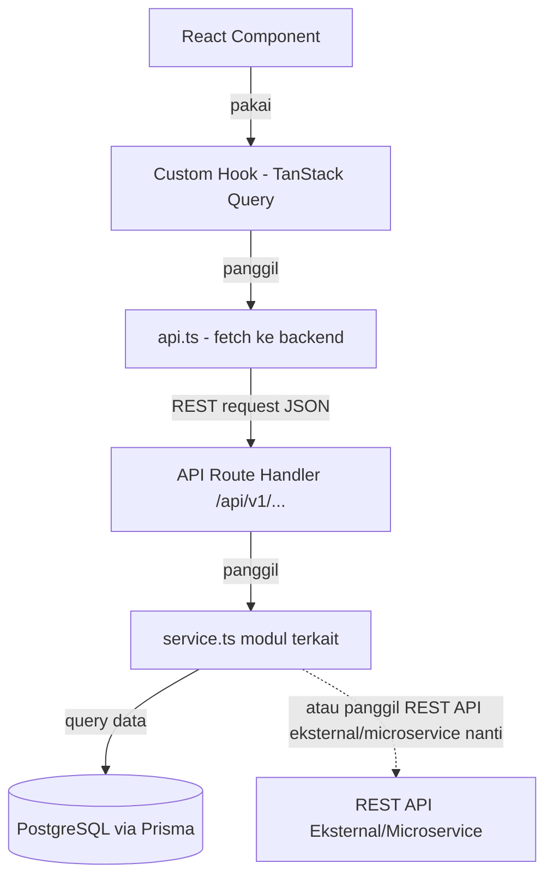
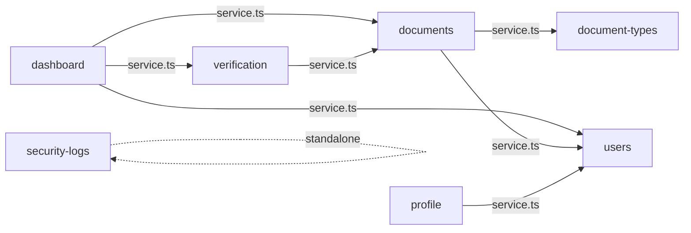

# Architecture — SMDP Portal

## 1. Gaya Arsitektur

**Monolit Modular Sederhana** — semua modul domain ada dalam satu codebase Next.js, tapi dipisah dengan batas modul yang jelas sehingga mudah dimigrasikan ke microservice di masa depan.

- **Tidak ada** event bus, message queue, atau dependency injection framework.
- **Tidak ada** gRPC atau GraphQL — hanya REST API (JSON over HTTP).
- Setiap modul punya **beberapa file dengan nama yang jelas** (`service.ts`, `repository.ts`, `validation.ts`, `api.ts`, `hooks.ts`).

---

## 2. Diagram Arsitektur Utama



---

## 3. Feature-Based Architecture

Setiap domain bisnis adalah satu **modul** yang terisolasi di dalam `src/modules/`:

```
src/modules/
├── auth/            # Login & sesi
├── users/           # CRUD pegawai, import/export CSV
├── document-types/  # Master jenis dokumen + kategori arsip
├── documents/       # Upload, lihat, hapus dokumen
├── verification/    # Approve/reject dokumen
├── profile/         # Update biodata mandiri
├── security-logs/   # Audit trail
├── dashboard/       # Agregasi statistik
├── settings/        # Konfigurasi sistem dinamis
└── backup/          # Export backup database
```

### Struktur File Dalam Satu Modul

```
modules/<nama-modul>/
├── service.ts       # Logika bisnis. SATU-SATUNYA file yang boleh diimpor modul lain
├── repository.ts    # Query Prisma. Hanya dipanggil service.ts modul sendiri
├── validation.ts    # Schema Zod untuk request validation
├── types.ts         # Interface/type TypeScript modul ini
├── api.ts           # Fungsi fetch() ke endpoint REST (digunakan di frontend)
├── hooks.ts         # useQuery/useMutation TanStack (digunakan di komponen)
└── components/      # Komponen React khusus modul ini
```

> **Catatan:** Modul boleh tidak memiliki semua file standar jika memang tidak dibutuhkan. Contoh: `backup` saat ini hanya berisi `service.ts`.

---

## 4. Shared Components

Komponen UI yang dipakai lintas modul ada di `src/components/`:

- `Sidebar` — navigasi utama, visibilitas menu berdasarkan role
- `Navbar` — header, info user, logout
- `StatsCard` — kartu statistik di dashboard
- Komponen Shadcn UI yang sudah dikustomisasi

---

## 5. Server vs Client Components

| Komponen | Tipe | Alasan |
|---|---|---|
| `page.tsx` | **Server Component** | Cek hak akses (`requireRole()`), render satu komponen modul |
| Komponen dengan state/interaksi | **Client Component** (`"use client"`) | Butuh hooks React, event handler |
| Data fetching | **Client** via TanStack Query | Tidak ada data prefetch server (cukup untuk skala ini) |
| `layout.tsx` (dashboard) | **Server Component** | Render Sidebar + Navbar |

**Aturan `page.tsx`:** hanya berisi cek role + render satu komponen. Logika tampilan TIDAK boleh ada di `page.tsx`.

```tsx
// Contoh page.tsx yang benar
import { requireRole } from "@/lib/auth-utils";
import { DocumentsView } from "@/modules/documents/components/DocumentsView";

export default async function DocumentsPage() {
  await requireRole(["ADMIN", "EMPLOYEE"]);
  return <DocumentsView />;
}
```

---

## 6. Data Flow

### Upload Dokumen
```
Pegawai pilih file
  → DocumentUploadForm (Client Component)
    → useUploadDocument() [hooks.ts]
      → documentApi.upload(formData) [api.ts]
        → POST /api/v1/documents/upload [route.ts]
          → documents/service.ts
            ├── validateFileFormat()
            ├── getStorageProvider().save()
            └── repository.createDocument() → PostgreSQL
          → logActivity("DOCUMENT_UPLOADED")
```

### Verifikasi Dokumen
```
ADMIN/STAFF klik Approve/Reject
  → VerificationActions (Client Component)
    → useVerifyDocument() [hooks.ts]
      → verificationApi.verify(id, decision) [api.ts]
        → POST /api/v1/verification/[id]/approve atau /reject [route.ts]
          → verification/service.ts
            ├── repository.updateDocumentStatus() → DocumentRecord.status
            └── repository.createVerificationHistory() → VerificationHistory
          → logActivity("DOCUMENT_APPROVED" | "DOCUMENT_REJECTED")
```

---

## 7. Dependency Antar Modul



**Aturan tegas:**
```ts
// ✅ BENAR — modul documents memanggil service.ts modul users
import { getUserById } from "@/modules/users/service";

// ❌ DILARANG — loncat pagar ke repository.ts modul lain
// import { findUserById } from "@/modules/users/repository";
```

---

## 8. Shared Library (`src/lib/`)

| File | Fungsi |
|---|---|
| `prisma.ts` | Singleton Prisma client — satu koneksi untuk semua modul |
| `auth-utils.ts` | `requireRole(roles[])` (server), `hasRole(session, role)` (client) |
| `api-client.ts` | Wrapper `fetch()` kecil yang dipakai semua `api.ts` modul |
| `security-log.ts` | `logActivity(eventType, actor, resource, metadata)` |
| `storage.ts` | `getStorageProvider()` — abstraksi lokal/cloud storage |
| `system-settings.ts` | Helper pengambilan konfigurasi dinamis dengan fallback |
| `utils.ts` | Utilitas umum aplikasi |

---

## 9. Authentication Layer

```mermaid
graph LR
    Request --> Middleware["src/middleware.ts"]
    Middleware --> Proxy["proxyMiddleware() di src/proxy.ts"]
    Proxy -->|tidak login| LoginPage[/login]
    Proxy -->|sudah login| ServerComponent[page.tsx Server Component]
    ServerComponent -->|requireRole| Content[Render Halaman]
    ServerComponent -->|role tidak cocok| Forbidden[403 / Redirect]
```

**3 Lapis Otorisasi:**
1. **Middleware** (`src/middleware.ts`, delegasi ke `src/proxy.ts`) — blokir akses sebelum sampai Next.js server
2. **Server Component** `requireRole()` — cek role di setiap `page.tsx`
3. **Client UI** `hasRole()` — sembunyikan elemen UI tidak relevan (kosmetik saja)

---

## 10. Rencana Migrasi ke Microservice

Karena arsitektur sudah modular:

1. Pilih modul dengan beban tinggi (kandidat: `documents` + `verification`)
2. Pindahkan tabel ke database baru
3. Buat REST API service terpisah
4. Ganti isi `service.ts` monolit: dari query Prisma → `fetch()` ke service baru
5. Modul lain **tidak perlu diubah** — mereka tetap memanggil fungsi yang sama

**Protokol tetap REST** — tidak berubah saat migrasi.
