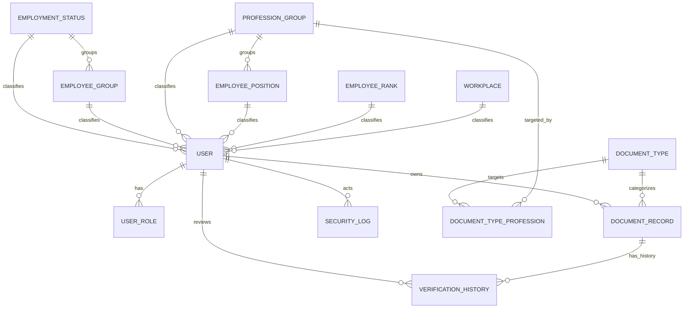

# Database — SMDP Portal

## 1. Ringkasan Prisma Schema

- **Database:** PostgreSQL (desain portabel ke MySQL)
- **ORM:** Prisma
- **File schema:** `prisma/schema.prisma`
- **Seeding:** `prisma/seed.ts`

**Prinsip desain:**
- Enum digunakan untuk nilai terbatas (Role, Status, Kategori)
- Semua tabel utama memiliki `createdAt`/`updatedAt`
- Index ditambahkan di kolom foreign key dan kolom yang sering difilter
- `allowedFormats` disimpan sebagai string `"pdf,jpg,png"` (portabel) — parsing via `parseAllowedFormats()` di `src/lib/`

---

## 2. Enum

### `Role`
| Nilai | Deskripsi |
|---|---|
| `ADMIN` | Administrator — akses penuh |
| `STAFF` | Staf — verifikasi dokumen, lihat data |
| `EMPLOYEE` | Pegawai biasa — upload dokumen milik sendiri |

### `DocumentArchiveCategory`
| Nilai | Deskripsi | Untuk |
|---|---|---|
| `UTAMA` | Dokumen identitas dasar, wajib | Semua pegawai |
| `KONDISIONAL` | Dokumen pendukung opsional | Opsional |
| `PROFESI` | Dokumen izin praktik | Tenaga medis/kesehatan |

### `DocumentStatus`
| Nilai | Deskripsi |
|---|---|
| `PENDING` | Baru diupload, menunggu verifikasi |
| `APPROVED` | Disetujui oleh ADMIN/STAFF |
| `REJECTED` | Ditolak oleh ADMIN/STAFF |

---

## 3. Seluruh Entity (Model)

### `User`
Data utama pegawai + akun login.

| Kolom | Tipe | Keterangan |
|---|---|---|
| `id` | String (cuid) PK | ID internal |
| `employeeId` | String UNIQUE | NIP pegawai |
| `email` | String UNIQUE | Email login |
| `passwordHash` | String | Hash bcryptjs |
| `name` | String | Nama lengkap |
| `role` | Role | Role utama (default: EMPLOYEE) |
| `gender` | String? | Opsional |
| `birthDate` | DateTime? | Opsional |
| `academicDegree` | String? | Gelar akademik (e.g. S.Ked, Sp.B) |
| `lastEducation` | String? | Pendidikan terakhir (SD, SMP, SMA/SMK, D3, D4/S1, S2, S3, Spesialis) |
| `religion` | String? | Agama (Islam, Kristen, Katolik, Hindu, Buddha, Khonghucu) |
| `maritalStatus` | String? | Status pernikahan (Belum Kawin, Kawin, Cerai Hidup, Cerai Meninggal) |
| `phone` | String? | Nomor telepon / WA |
| `address` | String? | Alamat lengkap tempat tinggal |
| `joinDate` | DateTime? | Tanggal masuk kerja pegawai |
| `employmentStatusId` | String? | FK → EmploymentStatus |
| `employeeGroupId` | String? | FK → EmployeeGroup |
| `professionGroupId` | String? | FK → ProfessionGroup |
| `employeePositionId` | String? | FK → EmployeePosition |
| `employeeRankId` | String? | FK → EmployeeRank |
| `workplaceId` | String? | FK → Workplace |
| `createdAt` | DateTime | Auto |
| `updatedAt` | DateTime | Auto update |

**Index:** `professionGroupId`

---

### `UserRole`
Mendukung multi-role per user (satu user bisa punya lebih dari satu role).

| Kolom | Tipe | Keterangan |
|---|---|---|
| `id` | String (cuid) PK | |
| `userId` | String FK | → User (onDelete: Cascade) |
| `role` | Role | |

**Constraint:** `@@unique([userId, role])` — kombinasi user+role unik

---

### `DocumentType`
Master jenis dokumen. Menentukan kategori arsip dan target profesi.

| Kolom | Tipe | Keterangan |
|---|---|---|
| `id` | String (cuid) PK | |
| `code` | String UNIQUE | Kode singkat, contoh: `STR-MEDIS` |
| `name` | String UNIQUE | Nama lengkap jenis dokumen |
| `description` | String? | Deskripsi opsional |
| `archiveCategory` | DocumentArchiveCategory | UTAMA / KONDISIONAL / PROFESI |
| `isMandatory` | Boolean | Apakah wajib dimiliki (default: false) |
| `requiresExpiryDate` | Boolean | Apakah perlu tanggal kedaluwarsa (default: false) |
| `allowedFormats` | String | Format file diizinkan, contoh: `"pdf,jpg,png"` |
| `maxSizeMb` | Int | Ukuran file maksimum (MB) |
| `icon` | String? | Nama ikon opsional |
| `createdAt` | DateTime | Auto |
| `updatedAt` | DateTime | Auto update |

**Index:** `archiveCategory`

---

### `DocumentTypeProfession`
Tabel relasi M:N antara `DocumentType` dan `ProfessionGroup`.
Menentukan jenis dokumen mana yang dipersyaratkan untuk kelompok profesi tertentu.

| Kolom | Tipe | Keterangan |
|---|---|---|
| `id` | String (cuid) PK | |
| `documentTypeId` | String FK | → DocumentType (onDelete: Cascade) |
| `professionGroupId` | String FK | → ProfessionGroup (onDelete: Cascade) |

**Constraint:** `@@unique([documentTypeId, professionGroupId])`

---

### `DocumentTypeEmploymentStatus`
Tabel relasi M:N antara `DocumentType` dan `EmploymentStatus`.
Menentukan jenis dokumen mana yang dipersyaratkan untuk status kepegawaian tertentu (e.g. ASN, Non ASN).

| Kolom | Tipe | Keterangan |
|---|---|---|
| `id` | String (cuid) PK | |
| `documentTypeId` | String FK | → DocumentType (onDelete: Cascade) |
| `employmentStatusId` | String FK | → EmploymentStatus (onDelete: Cascade) |

**Constraint:** `@@unique([documentTypeId, employmentStatusId])`

---

### `DocumentTypeEmployeeGroup`
Tabel relasi M:N antara `DocumentType` dan `EmployeeGroup`.
Menentukan jenis dokumen mana yang dipersyaratkan untuk jenis kepegawaian tertentu (e.g. PNS, PPPK, BLUD Tetap, BLUD Kontrak).

| Kolom | Tipe | Keterangan |
|---|---|---|
| `id` | String (cuid) PK | |
| `documentTypeId` | String FK | → DocumentType (onDelete: Cascade) |
| `employeeGroupId` | String FK | → EmployeeGroup (onDelete: Cascade) |

**Constraint:** `@@unique([documentTypeId, employeeGroupId])`

---

### `DocumentTypeEmployeeRank`
Tabel relasi M:N antara `DocumentType` dan `EmployeeRank`.
Menentukan jenis dokumen mana yang dipersyaratkan untuk pangkat/golongan tertentu.

| Kolom | Tipe | Keterangan |
|---|---|---|
| `id` | String (cuid) PK | |
| `documentTypeId` | String FK | → DocumentType (onDelete: Cascade) |
| `employeeRankId` | String FK | → EmployeeRank (onDelete: Cascade) |

**Constraint:** `@@unique([documentTypeId, employeeRankId])`

---

### `DocumentTypeWorkplace`
Tabel relasi M:N antara `DocumentType` dan `Workplace`.
Menentukan jenis dokumen mana yang dipersyaratkan untuk unit kerja / tempat tugas tertentu.

| Kolom | Tipe | Keterangan |
|---|---|---|
| `id` | String (cuid) PK | |
| `documentTypeId` | String FK | → DocumentType (onDelete: Cascade) |
| `workplaceId` | String FK | → Workplace (onDelete: Cascade) |

**Constraint:** `@@unique([documentTypeId, workplaceId])`

---

### `DocumentRecord`
Berkas dokumen yang diunggah oleh pegawai. Menyimpan status terkini langsung (tidak perlu query riwayat).

| Kolom | Tipe | Keterangan |
|---|---|---|
| `id` | String (cuid) PK | |
| `ownerId` | String FK | → User (onDelete: Cascade) |
| `documentTypeId` | String FK | → DocumentType |
| `status` | DocumentStatus | Status terkini (default: PENDING) |
| `fileName` | String | Nama asli file dari pegawai (ditampilkan di UI) |
| `filePath` | String | Nama file terstandarisasi di storage |
| `issueDate` | DateTime? | Tanggal terbit dokumen |
| `expiryDate` | DateTime? | Tanggal kedaluwarsa |
| `uploadedAt` | DateTime | Auto (waktu upload) |
| `updatedAt` | DateTime | Auto update |

**Index:** `ownerId`, `documentTypeId`, `status`

> **Penting:** `filePath` menggunakan format standar `{NIP}_{KATEGORI}_{KODE}_{YYYYMMDD}_{VERSI}.{ext}` — dibuat oleh fungsi `generateStorageFileName()` di `documents/service.ts`.

---

### `VerificationHistory`
Log riwayat verifikasi dokumen. Berfungsi sebagai **audit log** — bukan sumber status terkini (status terkini ada di `DocumentRecord.status`).

| Kolom | Tipe | Keterangan |
|---|---|---|
| `id` | String (cuid) PK | |
| `documentRecordId` | String FK | → DocumentRecord (onDelete: Cascade) |
| `status` | DocumentStatus | Keputusan pada langkah ini |
| `reviewedById` | String? FK | → User (onDelete: SetNull) |
| `reviewNote` | String? | Catatan alasan approve/reject |
| `reviewedAt` | DateTime | Auto |

**Index:** `documentRecordId`

> **Tidak boleh dihapus** — jika user reviewer dihapus, `reviewedById` di-set NULL (SetNull).

---

### `SecurityLog`
Audit trail seluruh aktivitas sensitif aplikasi.

| Kolom | Tipe | Keterangan |
|---|---|---|
| `id` | String (cuid) PK | |
| `timestamp` | DateTime | Auto |
| `actorId` | String? FK | → User (onDelete: SetNull) |
| `actorName` | String | Nama aktor saat kejadian (tidak berubah walau user diedit) |
| `actorRole` | String | Role aktor saat kejadian |
| `eventType` | String | Jenis event (contoh: `DOCUMENT_UPLOADED`) |
| `resource` | String | Resource yang diakses |
| `ipAddress` | String? | IP address aktor |
| `status` | String | Hasil aksi (success/failed) |
| `metadata` | Json? | Data konteks tambahan |

**Index:** `timestamp`, `eventType`

> **Tidak boleh dihapus** — jika user actor dihapus, `actorId` di-set NULL (SetNull), tapi `actorName` dan `actorRole` tetap tersimpan.

---

## 4. Master Data Kepegawaian

### `EmploymentStatus`
Status kepegawaian (PNS, PPPK, Honorer, dll).

| Kolom | Tipe | Keterangan |
|---|---|---|
| `id` | String (cuid) PK | |
| `name` | String UNIQUE | Nama status |

---

### `EmployeeGroup`
Kelompok pegawai — sub-kategori dari EmploymentStatus.

| Kolom | Tipe | Keterangan |
|---|---|---|
| `id` | String (cuid) PK | |
| `name` | String | |
| `employmentStatusId` | String FK | → EmploymentStatus |

**Constraint:** `@@unique([name, employmentStatusId])`

---

### `ProfessionGroup`
Kelompok profesi (Dokter, Perawat, Bidan, Tenaga Administrasi, dll).
Menentukan jenis dokumen Arsip Profesi yang dipersyaratkan.

| Kolom | Tipe | Keterangan |
|---|---|---|
| `id` | String (cuid) PK | |
| `name` | String UNIQUE | Nama kelompok profesi |

---

### `EmployeePosition`
Jabatan pegawai — sub-kategori dari ProfessionGroup.

| Kolom | Tipe | Keterangan |
|---|---|---|
| `id` | String (cuid) PK | |
| `name` | String | |
| `professionGroupId` | String FK | → ProfessionGroup |

**Constraint:** `@@unique([name, professionGroupId])`

---

### `EmployeeRank`
Pangkat/golongan pegawai.

| Kolom | Tipe | Keterangan |
|---|---|---|
| `id` | String (cuid) PK | |
| `name` | String UNIQUE | |

---

### `Workplace`
Unit kerja / satuan kerja pegawai.

| Kolom | Tipe | Keterangan |
|---|---|---|
| `id` | String (cuid) PK | |
| `name` | String UNIQUE | |

---

### `SystemSetting`
Tabel penyimpan konfigurasi dan preferensi sistem dinas yang dapat diatur oleh ADMIN secara dinamis via UI Halaman Settings.

| Kolom | Tipe | Keterangan |
|---|---|---|
| `key` | String PK | Identifikasi kunci pengaturan (contoh: `MAX_AVATAR_UPLOAD_SIZE_KB`, `SECURITY_LOG_RETENTION_DAYS`) |
| `value` | String | Nilai konfigurasi tersimpan dalam bentuk string |
| `label` | String? | Nama manusiawi untuk tampilan UI |
| `description` | String? | Penjelasan/deskripsi fungsi pengaturan |
| `updatedAt` | DateTime | Waktu terakhir kali diubah |

---

## 5. ERD (Entity Relationship)

---

## 6. Relationship Summary

| Dari | Ke | Tipe | Keterangan |
|---|---|---|---|
| User → UserRole | 1:N | Has many | Multi-role per user |
| User → DocumentRecord | 1:N | Has many | Dokumen milik pegawai |
| User → VerificationHistory | 1:N | Has many | Sebagai reviewer |
| User → SecurityLog | 1:N | Has many | Sebagai aktor |
| DocumentType → DocumentRecord | 1:N | Has many | Jenis dokumen → berkas |
| DocumentType → DocumentTypeProfession | M:N | Via junction | Target profesi |
| ProfessionGroup → DocumentTypeProfession | M:N | Via junction | Profesi → jenis dokumen |
| DocumentRecord → VerificationHistory | 1:N | Has many | Riwayat verifikasi |
| EmploymentStatus → EmployeeGroup | 1:N | Has many | |
| ProfessionGroup → EmployeePosition | 1:N | Has many | |

---

## 7. Cascade & Constraint Penting (Kebijakan Penghapusan Data)

Untuk menjaga integritas data kepegawaian dan audit trail, aplikasi menggunakan kombinasi strategi **CASCADE** dan **SET NULL** saat data dihapus oleh Admin:

### A. Tabel & Data yang Di-CASCADE (Terhapus Otomatis)

Data anak atau data relasi langsung yang tidak memiliki arti tanpa entitas utamanya akan otomatis terhapus (*Cascade*):

| Penghapusan Entitas Utama | Data yang Di-CASCADE (Terhapus Otomatis) | Alasan & Dampak |
|---|---|---|
| **Hapus Akun `User`** | `UserRole`, `DocumentRecord` milik pegawai tersebut | Seluruh hak akses role dan berkas dokumen milik akun tersebut dibersihkan dari database. |
| **Hapus `DocumentRecord`** | `VerificationHistory` terkait berkas tersebut | Seluruh histori catatan verifikasi dokumen tersebut ikut terhapus. |
| **Hapus `DocumentType`** | `DocumentTypeProfession`, `DocumentTypeEmploymentStatus`, `DocumentTypeEmployeeGroup`, `DocumentTypeEmployeeRank`, `DocumentTypeWorkplace` | Seluruh kriteria pemetaan target kualifikasi dokumen tersebut dibersihkan. |
| **Hapus Master `EmploymentStatus`** | `EmployeeGroup` (Jenis Kepegawaian di bawahnya) & `DocumentTypeEmploymentStatus` | Sub-kategori jenis kepegawaian induk tersebut ikut dibersihkan. |
| **Hapus Master `ProfessionGroup`** | `EmployeePosition` (Jabatan di bawahnya) & `DocumentTypeProfession` | Sub-kategori jabatan induk tersebut ikut dibersihkan. |

---

### B. Tabel & Data yang Di-SET NULL (Pegawai/Audit Tetap Aman & Utuh)

Data penting seperti **Akun Pegawai** dan **Log Audit** **TIDAK PERNAH DI-CASCADE** ketika master data atau user reviewer dihapus. Tautan relasinya di-SET NULL agar akun pegawai dan riwayat hukum audit tidak pernah hilang:

| Penghapusan Master / User | Field yang Di-SET NULL | Perlindungan Data |
|---|---|---|
| **Hapus Master `EmploymentStatus`** | `User.employmentStatusId` → `NULL` | **Akun Pegawai TETAP ADA.** Pegawai hanya kehilangan label statusnya dan siap diset ulang oleh Admin. |
| **Hapus Master `EmployeeGroup`** | `User.employeeGroupId` → `NULL` | **Akun Pegawai TETAP ADA.** Pegawai hanya kehilangan label jenis kepegawaiannya. |
| **Hapus Master `ProfessionGroup`** | `User.professionGroupId` → `NULL` | **Akun Pegawai TETAP ADA.** Pegawai hanya kehilangan label kelompok profesinya. |
| **Hapus Master `EmployeePosition`** | `User.employeePositionId` → `NULL` | **Akun Pegawai TETAP ADA.** Pegawai hanya kehilangan label jabatannya. |
| **Hapus Master `EmployeeRank`** | `User.employeeRankId` → `NULL` | **Akun Pegawai TETAP ADA.** Pegawai hanya kehilangan label pangkat/golongannya. |
| **Hapus Master `Workplace`** | `User.workplaceId` → `NULL` | **Akun Pegawai TETAP ADA.** Pegawai hanya kehilangan label unit kerjanya. |
| **Hapus `User` (Reviewer/Verifikator)** | `VerificationHistory.reviewedById` → `NULL` | Histori verifikasi dokumen tetap tersimpan utuh untuk kebutuhan audit pertanggungjawaban. |
| **Hapus `User` (Aktor Kegiatan)** | `SecurityLog.actorId` → `NULL` | Log aktivitas keamanan tetap tersimpan utuh. Nama aktor (`actorName`) dan role (`actorRole`) tetap tercatat permanen dalam teks snapshot log. |

> **⚠️ Aturan Hukum Audit Sistem:** Tabel `VerificationHistory` dan `SecurityLog` **TIDAK BOLEH DIHAPUS** secara langsung dari sistem untuk menjamin integritas hukum dan pelacakan audit (*audit trail*).

---

## 8. Fungsi Helper Database

| Fungsi | Lokasi | Keterangan |
|---|---|---|
| `parseAllowedFormats(str)` | `src/lib/` | Parsing `"pdf,jpg,png"` → `["pdf", "jpg", "png"]` |
| `generateStorageFileName()` | `src/modules/documents/service.ts` | Generate nama file standar |
| `slugifyFileName()` | `src/lib/` | Sanitasi nama file (no spasi, hanya `[A-Za-z0-9._-]`) |
