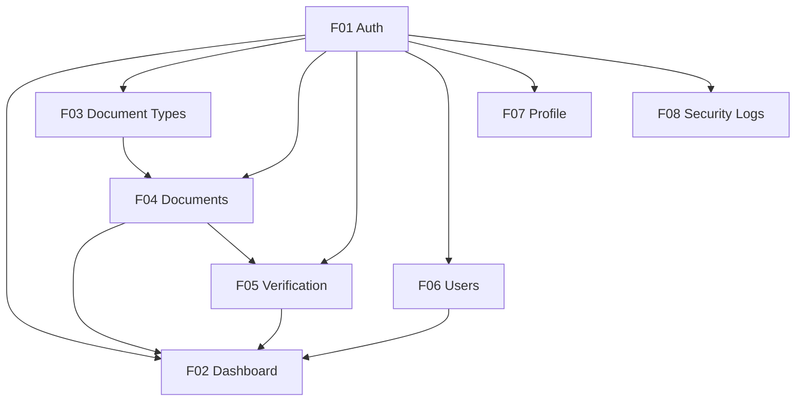

# Features — SMDP Portal

## 1. Daftar Semua Feature

### F01 — Autentikasi (auth)

| Atribut | Detail |
|---|---|
| **Modul** | `src/modules/auth/` |
| **Status** | 🔴 Belum dimulai |
| **Role** | Semua role (public endpoint) |
| **Dependency** | — |

**Sub-fitur:**
- Login dengan email + password
- Sesi berbasis cookie (NextAuth)
- Logout
- Session check (sesi aktif/tidak)

---

### F02 — Dashboard

| Atribut | Detail |
|---|---|
| **Modul** | `src/modules/dashboard/` |
| **Status** | 🔴 Belum dimulai |
| **Role** | Semua role (konten berbeda per role) |
| **Dependency** | F01 (Auth), F04 (Documents), F05 (Verification), F06 (Users) |

**Sub-fitur:**
- Statistik jumlah dokumen per status (PENDING/APPROVED/REJECTED)
- Statistik dokumen mendekati kedaluwarsa
- Ringkasan berdasarkan role:
  - `ADMIN`: semua statistik
  - `STAFF`: statistik verifikasi
  - `EMPLOYEE`: statistik dokumen milik sendiri

---

### F03 — Manajemen Jenis Dokumen (document-types)

| Atribut | Detail |
|---|---|
| **Modul** | `src/modules/document-types/` |
| **Status** | 🔴 Belum dimulai |
| **Role** | `ADMIN` |
| **Dependency** | F01 (Auth) |

**Sub-fitur:**
- Buat jenis dokumen baru (dengan kategori arsip + target profesi)
- Edit jenis dokumen
- Hapus jenis dokumen
- Lihat daftar jenis dokumen + filter per kategori
- Assign `DocumentType` ke satu atau lebih `ProfessionGroup`

---

### F04 — Manajemen Dokumen (documents)

| Atribut | Detail |
|---|---|
| **Modul** | `src/modules/documents/` |
| **Status** | 🔴 Belum dimulai |
| **Role** | `EMPLOYEE` (upload/lihat sendiri), `ADMIN` (semua) |
| **Dependency** | F01 (Auth), F03 (Document Types) |

**Sub-fitur:**
- Upload dokumen (file + metadata: issueDate, expiryDate)
- Tampilkan dokumen dalam 3 tab: Arsip Utama / Kondisional / Profesi
- Hapus dokumen (EMPLOYEE: milik sendiri + bukan APPROVED; ADMIN: semua)
- Download dokumen
- Filter dokumen per status dan kategori
- Generate nama file standar (`generateStorageFileName()`)

---

### F05 — Verifikasi Dokumen (verification)

| Atribut | Detail |
|---|---|
| **Modul** | `src/modules/verification/` |
| **Status** | 🔴 Belum dimulai |
| **Role** | `ADMIN`, `STAFF` |
| **Dependency** | F01 (Auth), F04 (Documents) |

**Sub-fitur:**
- Tampilkan daftar dokumen PENDING
- Detail dokumen + pratinjau file
- Approve dokumen (+ simpan ke VerificationHistory)
- Reject dokumen + catatan alasan (+ simpan ke VerificationHistory)
- Riwayat verifikasi per dokumen

---

### F06 — Manajemen Pengguna / Pegawai (users)

| Atribut | Detail |
|---|---|
| **Modul** | `src/modules/users/` |
| **Status** | 🔴 Belum dimulai |
| **Role** | `ADMIN` |
| **Dependency** | F01 (Auth) |

**Sub-fitur:**
- Daftar pegawai + search by nama/NIP
- Filter by profesi, unit kerja, status kepegawaian
- Buat pegawai baru
- Edit data pegawai
- Hapus pegawai (cascade: dokumen & role ikut terhapus)
- Export data pegawai ke CSV
- Import pegawai dari CSV (batch)

---

### F07 — Profil Mandiri (profile)

| Atribut | Detail |
|---|---|
| **Modul** | `src/modules/profile/` |
| **Status** | 🔴 Belum dimulai |
| **Role** | Semua role |
| **Dependency** | F01 (Auth) |

**Sub-fitur:**
- Lihat profil diri sendiri
- Update biodata (nama, gender, tanggal lahir)
- Ganti password (jika diperlukan — belum didefinisikan di PRD)

---

### F08 — Security Logs / Audit Trail (security-logs)

| Atribut | Detail |
|---|---|
| **Modul** | `src/modules/security-logs/` |
| **Status** | 🔴 Belum dimulai |
| **Role** | `ADMIN` |
| **Dependency** | F01 (Auth) |

**Sub-fitur:**
- Tampilkan daftar log aktivitas
- Filter by event type, aktor, rentang tanggal
- Pagination
- Detail metadata per log entry

---

## 2. Status Feature Summary

| Kode | Feature | Status |
|---|---|---|
| F01 | Autentikasi | 🔴 Belum dimulai |
| F02 | Dashboard | 🔴 Belum dimulai |
| F03 | Manajemen Jenis Dokumen | 🔴 Belum dimulai |
| F04 | Manajemen Dokumen | 🔴 Belum dimulai |
| F05 | Verifikasi Dokumen | 🔴 Belum dimulai |
| F06 | Manajemen Pegawai | 🔴 Belum dimulai |
| F07 | Profil Mandiri | 🔴 Belum dimulai |
| F08 | Security Logs | 🔴 Belum dimulai |

**Legend:**
- 🔴 Belum dimulai
- 🟡 Sedang dikerjakan
- 🟢 Selesai
- ⚪ Opsional / Backlog

---

## 3. Dependency Graph Feature

**Urutan implementasi yang disarankan:**
1. F01 — Auth (dasar semua fitur)
2. F03 — Document Types (master data, diperlukan F04)
3. F06 — Users (CRUD pegawai)
4. F04 — Documents (upload + tampilan)
5. F05 — Verification (approve/reject)
6. F07 — Profile
7. F08 — Security Logs
8. F02 — Dashboard (terakhir, merangkum semua)

---

## 4. Future Features (Backlog / Opsional)

| Feature | Status | Keterangan |
|---|---|---|
| Notifikasi WhatsApp/Email untuk dokumen mendekati kedaluwarsa | ⚪ Backlog | Belum diimplementasi — masuk pengembangan lanjutan |
| Enkripsi file di storage (AES-256) | ⚪ Backlog | Belum diimplementasi — implementasikan saat dianggap mendesak |
| `eslint-plugin-boundaries` untuk enforce aturan antar modul via CI | ⚪ Opsional | Pasang setelah tim sudah nyaman dengan aturan manual |
| Message broker (RabbitMQ/Kafka) menggantikan `logActivity()` langsung | ⚪ Opsional | Hanya relevan jika modul sudah dipisah jadi microservice |
| Microservice extraction (documents + verification) | ⚪ Future | Langkah 1 migrasi microservice |
| Dashboard analytics lanjutan (grafik tren, export laporan) | ⚪ Future | Tidak ada di PRD v1.0 |
| Ganti password mandiri | ⚪ Belum didefinisikan | Belum ada di PRD — perlu klarifikasi |
| Reset password via email | ⚪ Belum didefinisikan | Belum ada di PRD — perlu klarifikasi |
| Multi-language / i18n | ⚪ Tidak ada rencana | Tidak disebutkan di PRD |

---

## 5. Shared Infrastructure (bukan fitur, tapi diperlukan semua fitur)

| Komponen | File | Status | Keterangan |
|---|---|---|---|
| Prisma Client | `src/lib/prisma.ts` | 🔴 Belum | Singleton connection |
| Auth Utils | `src/lib/auth-utils.ts` | 🔴 Belum | `requireRole()`, `hasRole()` |
| API Client | `src/lib/api-client.ts` | 🔴 Belum | Fetch wrapper |
| Security Log Helper | `src/lib/security-log.ts` | 🔴 Belum | `logActivity()` |
| Storage Provider | `src/lib/storage.ts` | 🔴 Belum | `getStorageProvider()` |
| File Utilities | `src/lib/` | 🔴 Belum | `parseAllowedFormats()`, `slugifyFileName()` |
| QueryClientProvider | `src/app/providers.tsx` | 🔴 Belum | TanStack Query setup |
| Root Layout | `src/app/layout.tsx` | 🔴 Belum | HTML shell + Providers |
| Dashboard Layout | `src/app/(dashboard)/layout.tsx` | 🔴 Belum | Sidebar + Navbar |
| Middleware | `src/proxy.ts` | 🔴 Belum | Route protection |
| Prisma Schema | `prisma/schema.prisma` | 🔴 Belum | Database schema |
| Seed Data | `prisma/seed.ts` | 🔴 Belum | Data awal master |
