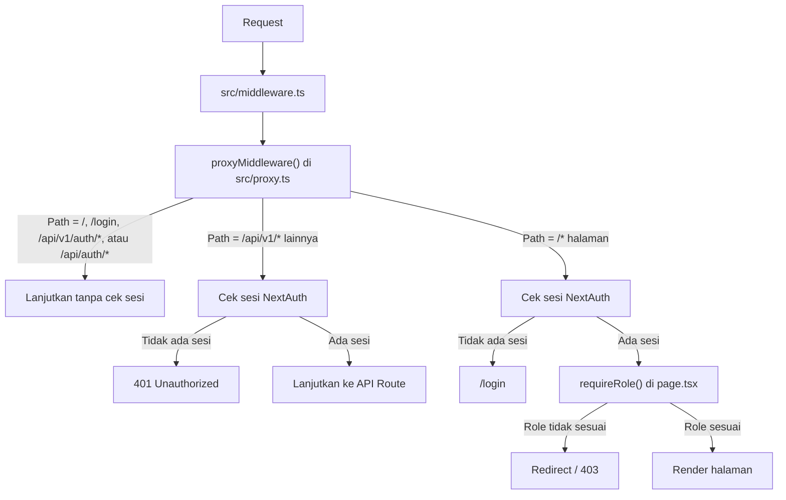

# Routing — SMDP Portal

## 1. Overview

Framework: **Next.js App Router** — routing berbasis filesystem di `src/app/`.

- **Route Group** `(dashboard)` — semua halaman yang membutuhkan login
- **Route Group** tidak mempengaruhi URL (nama dalam kurung tidak muncul di path)
- **API Routes** menggunakan versi prefix `/api/v1/` sejak awal

---

## 2. Seluruh Route Aplikasi

### Public Routes (tanpa login)

| Path | File | Deskripsi |
|---|---|---|
| `/` | `src/app/page.tsx` | Halaman landing / redirect ke login |
| `/login` | `src/app/login/page.tsx` | Halaman login |
| `/api/auth/*` | `src/app/api/auth/[...nextauth]/route.ts` | Endpoint canonical NextAuth (login, session, signout) |

---

### Protected Routes (butuh login — dalam route group `(dashboard)`)

Semua halaman di bawah ini berada di dalam `src/app/(dashboard)/` dan di-wrap oleh `src/app/(dashboard)/layout.tsx` yang berisi Sidebar + Navbar.

| Path | File | Role yang Diizinkan | Deskripsi |
|---|---|---|---|
| `/dashboard` | `(dashboard)/dashboard/page.tsx` | Semua role | Ringkasan statistik sesuai role |
| `/documents` | `(dashboard)/documents/page.tsx` | `ADMIN`, `EMPLOYEE` | Daftar dokumen (3 tab arsip) |
| `/documents/[id]` | `(dashboard)/documents/[id]/page.tsx` | `ADMIN`, pemilik dokumen | Detail dokumen, preview file, dan properti arsip |
| `/verification` | `(dashboard)/verification/page.tsx` | `ADMIN`, `STAFF` | Daftar dokumen PENDING |
| `/document-types` | `(dashboard)/document-types/page.tsx` | `ADMIN` | Master jenis dokumen |
| `/document-types/add` | `(dashboard)/document-types/add/page.tsx` | `ADMIN` | Tambah jenis dokumen |
| `/document-types/[id]/edit` | `(dashboard)/document-types/[id]/edit/page.tsx` | `ADMIN` | Edit jenis dokumen |
| `/document-types/archives` | `(dashboard)/document-types/archives/page.tsx` | `ADMIN` | Arsip seluruh pegawai berdasarkan jenis dokumen |
| `/users` | `(dashboard)/users/page.tsx` | `ADMIN` | Daftar pegawai |
| `/users/new` | `(dashboard)/users/new/page.tsx` | `ADMIN` | Tambah pegawai |
| `/users/[id]` | `(dashboard)/users/[id]/page.tsx` | `ADMIN` | Detail pegawai |
| `/users/[id]/edit` | `(dashboard)/users/[id]/edit/page.tsx` | `ADMIN` | Edit pegawai |
| `/users/categories` | `(dashboard)/users/categories/page.tsx` | `ADMIN` | Master kategori kepegawaian |
| `/security-logs` | `(dashboard)/security-logs/page.tsx` | `ADMIN` | Audit trail |
| `/settings` | `(dashboard)/settings/page.tsx` | `ADMIN` | Pengaturan & konfigurasi sistem dinamis |
| `/profile` | `(dashboard)/profile/page.tsx` | Semua role | Update biodata mandiri |
| `/previews` | `(dashboard)/previews/page.tsx` | Internal/dev | Preview komponen UI |

---

### API Routes

| Endpoint | Method | File | Role |
|---|---|---|---|
| `/api/auth/*` | * | `api/auth/[...nextauth]/route.ts` | Public |
| `/api/v1/auth/verify-password` | `POST` | `api/v1/auth/verify-password/route.ts` | Semua role |
| `/api/v1/dashboard/stats` | `GET` | `api/v1/dashboard/stats/route.ts` | Semua role |
| `/api/v1/profile` | `GET`, `PUT` | `api/v1/profile/route.ts` | Semua role |
| `/api/v1/profile/password` | `PUT` | `api/v1/profile/password/route.ts` | Semua role |
| `/api/v1/profile/avatar` | `POST` | `api/v1/profile/avatar/route.ts` | Semua role |
| `/api/v1/profile/avatar/view` | `GET` | `api/v1/profile/avatar/view/route.ts` | Semua role |
| `/api/v1/document-types` | `GET` | `api/v1/document-types/route.ts` | Public, dengan konteks user opsional |
| `/api/v1/document-types` | `POST` | `api/v1/document-types/route.ts` | `ADMIN` |
| `/api/v1/document-types/[id]` | `GET` | `api/v1/document-types/[id]/route.ts` | `ADMIN`, `STAFF` |
| `/api/v1/document-types/[id]` | `PATCH`, `DELETE` | `api/v1/document-types/[id]/route.ts` | `ADMIN` |
| `/api/v1/document-types/archives` | `GET` | `api/v1/document-types/archives/route.ts` | `ADMIN` |
| `/api/v1/document-types/archives/export` | `GET` | `api/v1/document-types/archives/export/route.ts` | `ADMIN` |
| `/api/v1/documents` | `GET` | `api/v1/documents/route.ts` | Semua role |
| `/api/v1/documents/upload` | `POST` | `api/v1/documents/upload/route.ts` | `EMPLOYEE` |
| `/api/v1/documents/[id]` | `GET` | `api/v1/documents/[id]/route.ts` | `ADMIN`, pemilik |
| `/api/v1/documents/[id]` | `DELETE` | `api/v1/documents/[id]/route.ts` | `EMPLOYEE` (milik sendiri, bukan APPROVED), `ADMIN` |
| `/api/v1/documents/download` | `GET` | `api/v1/documents/download/route.ts` | `ADMIN`, pemilik |
| `/api/v1/users` | `GET`, `POST` | `api/v1/users/route.ts` | `ADMIN` |
| `/api/v1/users/[id]` | `GET`, `PATCH`, `DELETE` | `api/v1/users/[id]/route.ts` | `ADMIN` |
| `/api/v1/users/[id]/documents/export` | `GET` | `api/v1/users/[id]/documents/export/route.ts` | `ADMIN` |
| `/api/v1/users/categories` | `GET` | `api/v1/users/categories/route.ts` | Semua role |
| `/api/v1/users/categories` | `POST`, `PATCH`, `DELETE` | `api/v1/users/categories/route.ts` | `ADMIN` |
| `/api/v1/verification` | `GET` | `api/v1/verification/route.ts` | `ADMIN`, `STAFF` |
| `/api/v1/verification/[id]/approve` | `POST` | `api/v1/verification/[id]/approve/route.ts` | `ADMIN`, `STAFF` |
| `/api/v1/verification/[id]/reject` | `POST` | `api/v1/verification/[id]/reject/route.ts` | `ADMIN`, `STAFF` |
| `/api/v1/verification/document/[id]` | `GET` | `api/v1/verification/document/[id]/route.ts` | `ADMIN`, `STAFF` |
| `/api/v1/security-logs` | `GET` | `api/v1/security-logs/route.ts` | `ADMIN` |
| `/api/v1/settings` | `GET`, `PATCH` | `api/v1/settings/route.ts` | `ADMIN` |
| `/api/v1/backup/export` | `GET` | `api/v1/backup/export/route.ts` | `ADMIN` |


---

## 3. Route Groups

### `(dashboard)` — Route Group Halaman Terproteksi

```
src/app/
└── (dashboard)/
    ├── layout.tsx          ← Sidebar + Navbar, cek sesi aktif
    ├── dashboard/
    │   └── page.tsx
    ├── documents/
    │   ├── page.tsx
    │   └── [id]/page.tsx
    ├── verification/
    │   └── page.tsx
    ├── document-types/
    │   ├── page.tsx
    │   ├── add/page.tsx
    │   ├── [id]/edit/page.tsx
    │   └── archives/page.tsx
    ├── users/
    │   ├── page.tsx
    │   ├── new/page.tsx
    │   ├── [id]/page.tsx
    │   ├── [id]/edit/page.tsx
    │   └── categories/page.tsx
    ├── settings/
    │   └── page.tsx
    ├── security-logs/
    │   └── page.tsx
    └── profile/
        └── page.tsx
```

Semua URL tetap tanpa prefix `(dashboard)`:
- `(dashboard)/dashboard/page.tsx` → URL: `/dashboard`
- `(dashboard)/users/page.tsx` → URL: `/users`

---

## 4. Middleware Flow



**File Middleware:** `src/middleware.ts` adalah entrypoint Next.js dan mendelegasikan logic ke `src/proxy.ts`.

---

## 5. Layout Hierarchy

```
src/app/layout.tsx                  ← Root layout: HTML shell + <Providers>
└── src/app/(dashboard)/layout.tsx  ← Dashboard layout: Sidebar + Navbar
    └── page.tsx (masing-masing)    ← Halaman individual
```

**Root layout** (`src/app/layout.tsx`):
- Membungkus semua halaman
- Menyertakan `<Providers>` (QueryClientProvider + NextAuth SessionProvider)
- Bahasa: `lang="id"`

**Dashboard layout** (`src/app/(dashboard)/layout.tsx`):
- Renders Sidebar + Navbar
- Cek apakah sesi aktif (redirect ke `/login` jika tidak)

---

## 6. Dynamic Routes

| Segment | Contoh URL | Keterangan |
|---|---|---|
| `[id]` | `/users/clx123abc` | ID user untuk detail/edit pegawai |
| `[id]` | `/document-types/clx123abc/edit` | ID jenis dokumen untuk edit master jenis dokumen |
| `[id]` | `/documents/clx123abc` | ID dokumen untuk detail dan preview dokumen |
| `[id]` | `/api/v1/verification/document/clx123abc` | ID dokumen untuk detail verifikasi API |
| `[...nextauth]` | `/api/v1/auth/signin`, `/api/v1/auth/session` | Catch-all NextAuth handler |

---

## 7. Konvensi `page.tsx`

Setiap `page.tsx` hanya boleh berisi:
1. Cek hak akses (`requireRole()`)
2. Render satu komponen utama dari modul

```tsx
// Contoh: src/app/(dashboard)/users/page.tsx
import { requireRole } from "@/lib/auth-utils";
import { UsersView } from "@/modules/users/components/UsersView";

export default async function UsersPage() {
  await requireRole(["ADMIN"]);
  return <UsersView />;
}
```

> **Dilarang:** Menulis logika tampilan, state, fetch, atau kondisi render langsung di `page.tsx`.

---

## 8. API Versioning

Semua API Routes menggunakan prefix `/api/v1/`:

- Perubahan breaking pada kontrak API → buat `/api/v2/` tanpa mengganggu `/api/v1/`
- Tidak ada endpoint tanpa versi kecuali auth (`/api/v1/auth/*` sudah termasuk versi)

---

## 9. Query Parameters API

| Endpoint | Query Param | Tipe | Contoh | Keterangan |
|---|---|---|---|---|
| `GET /api/v1/documents` | `category` | `DocumentArchiveCategory` | `?category=UTAMA` | Filter per kategori arsip |
| `GET /api/v1/documents` | `status` | `DocumentStatus` | `?status=PENDING` | Filter per status |
| `GET /api/v1/users` | `search` | string | `?search=Budi` | Cari pegawai by nama/NIP |
| `GET /api/v1/security-logs` | `eventType` | string | `?eventType=DOCUMENT_UPLOADED` | Filter log by tipe event |
| `DELETE /api/v1/users/categories` | `id` | string | `?id=clx...` | ID kategori master yang akan dihapus |
| `DELETE /api/v1/users/categories` | `type` | `CategoryType` | `?type=WORKPLACE` | Tipe kategori master yang akan dihapus |
